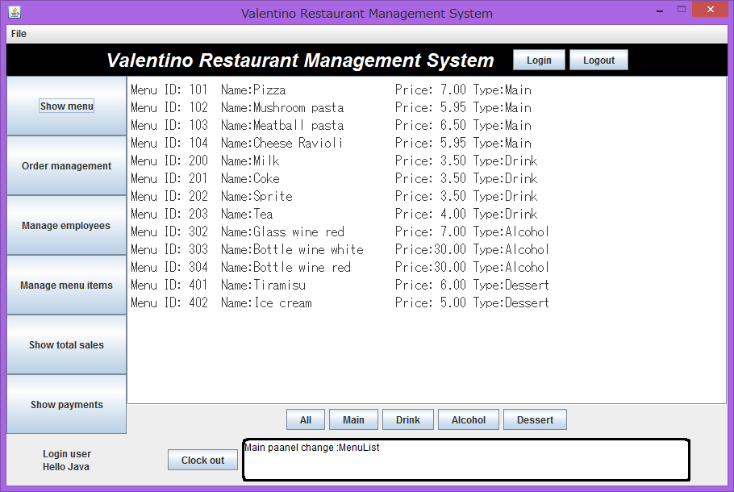
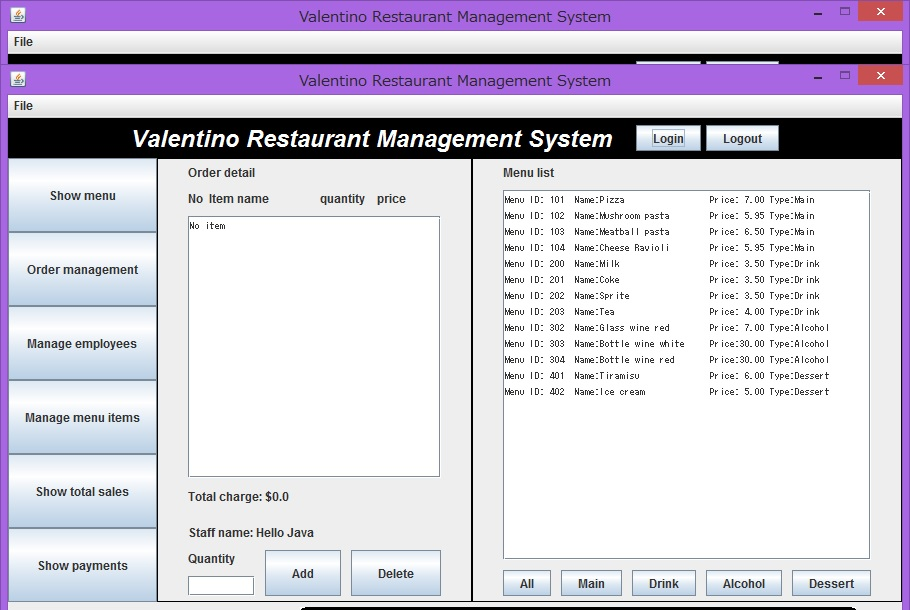

# 🍽️ Valentino Restaurant Management System

A Java-based **Restaurant Management System** designed to simplify restaurant operations such as menu management, order processing, staff management, employee records, and restaurant data handling.

The project provides both **console-based and graphical user interfaces (GUI)** and uses file-based storage for managing application data.

---

## 📌 Features

### 👤 User Management

* Staff and manager management
* Employee information handling
* Role-based access to restaurant operations
* Authentication using stored credentials

### 🍔 Menu Management

* Add and manage menu items
* View available menu items
* Store menu information persistently
* Sort and organize menu data

### 🧾 Order Management

* Create and manage customer orders
* Handle multiple order details
* Calculate order-related information
* Maintain restaurant order records

### 👨‍💼 Staff & Employee Management

* Manage employee information
* Maintain staff records
* Manage wage information
* Manager-specific functionality

### 🖥️ Graphical User Interface

* Java-based GUI
* User-friendly restaurant management interface
* Dedicated screens for different restaurant operations
* Image-based interface elements

### 💾 File-Based Data Storage

The application uses local text files to store restaurant data, including:

* Menu items
* Staff information
* Manager information
* Wage information

> 🔒 Sensitive data files containing real credentials are intentionally excluded from this repository using `.gitignore`.

---

## 🛠️ Technologies Used

| Technology                      | Purpose                      |
| ------------------------------- | ---------------------------- |
| **Java**                        | Core application development |
| **Java Swing / GUI**            | Graphical user interface     |
| **Java Collections**            | Data management and sorting  |
| **File Handling**               | Persistent data storage      |
| **Object-Oriented Programming** | Application architecture     |
| **Git & GitHub**                | Version control              |

---

## 📂 Project Structure

```text
Valentino_Resturant_management_system/
│
├── Controller.java
├── Controller_GUI.java
│
├── Database.java
├── DatabaseException.java
│
├── Employee.java
├── Manager.java
├── Staff.java
│
├── MenuItem.java
├── Order.java
├── OrderDetail.java
│
├── RMS.java
├── RMS_GUI.java
│
├── UserInterface.java
├── UserInterface_GUI.java
│
├── META-INF/
│   └── MANIFEST.MF
│
├── dataFiles/
│   └── menu_item.txt
│
├── images/
│   ├── Logo.jpg
│   ├── home.jpg
│   ├── home1.jpg
│   ├── home2.jpg
│   ├── home3.jpg
│   └── home4.jpg
│
├── readme_images/
│   ├── order.jpg
│   └── showmenu.png
│
├── .gitignore
├── .gitattributes
└── README.md
```

---

## 🏗️ Application Architecture

The application follows a modular object-oriented structure:

```text
                    ┌─────────────────────┐
                    │   User Interface    │
                    │   CLI / GUI         │
                    └──────────┬──────────┘
                               │
                               ▼
                    ┌─────────────────────┐
                    │    Controllers      │
                    │ Controller / GUI    │
                    └──────────┬──────────┘
                               │
                               ▼
                    ┌─────────────────────┐
                    │   Business Models   │
                    │                     │
                    │ Employee            │
                    │ Staff               │
                    │ Manager             │
                    │ MenuItem            │
                    │ Order               │
                    │ OrderDetail         │
                    └──────────┬──────────┘
                               │
                               ▼
                    ┌─────────────────────┐
                    │      Database       │
                    │  File-based Storage │
                    └─────────────────────┘
```

---

## 🚀 Getting Started

### Prerequisites

Make sure you have:

* **Java JDK 8 or later**
* Java compiler (`javac`)
* Java Runtime Environment (`java`)
* Git (optional, for cloning the repository)

Check your Java installation:

```bash
java -version
```

Check the Java compiler:

```bash
javac -version
```

---

## 📥 Clone the Repository

```bash
git clone https://github.com/vishalydv25/Valentino_Resturant_management_system.git
```

Navigate to the project directory:

```bash
cd Valentino_Resturant_management_system
```

---

## ▶️ Running the Application

### Option 1 — Using the Java GUI

Compile the Java source files:

```bash
javac *.java
```

Then run the GUI application:

```bash
java RMS_GUI
```

### Option 2 — Running the Console Version

```bash
java RMS
```

> The exact startup class may vary depending on the configuration of your Java environment and project setup.

---

## 🖼️ Screenshots

### Home Interface



### Order Management



---

## 🔐 Security

This repository intentionally **does not contain sensitive credential files**.

The following files are excluded using `.gitignore`:

```text
dataFiles/manager.txt
dataFiles/staff.txt
dataFiles/wage_info.txt
```

These files may contain authentication or sensitive employee information and should **never be committed to a public repository**.

For a production-ready implementation, credentials should be replaced with:

* Secure password hashing
* Environment variables
* A proper database
* Role-based authentication
* Secure secret management

---

## 💡 Key Concepts Demonstrated

This project demonstrates several important Java and software development concepts:

* Object-Oriented Programming
* Classes and Objects
* Encapsulation
* Inheritance
* Exception Handling
* File I/O
* Collections Framework
* Comparators and Sorting
* GUI Development
* Modular application design
* Data persistence
* Basic authentication
* MVC-style separation of responsibilities

---

## 🔮 Future Improvements

Potential improvements for future versions include:

* [ ] Replace text-file storage with MySQL/PostgreSQL
* [ ] Implement secure password hashing
* [ ] Add database-backed authentication
* [ ] Add administrator dashboard
* [ ] Add inventory management
* [ ] Add billing and invoice generation
* [ ] Add sales reports and analytics
* [ ] Add customer management
* [ ] Improve responsive GUI design
* [ ] Add automated unit and integration testing
* [ ] Add comprehensive logging
* [ ] Package the application as a standalone executable

---

## 🎓 Project Purpose

This project was developed as a **Java-based restaurant management application** to demonstrate practical implementation of object-oriented programming, GUI development, file handling, data management, and software design concepts.

It can serve as an academic project as well as a foundation for developing a more complete restaurant management solution.

---

## 👨‍💻 Author

**Vishal Yadav**

GitHub: [@vishalydv25](https://github.com/vishalydv25)

---

## 📄 License

This project is intended primarily for **educational and academic purposes**.

If you plan to reuse or distribute the project, please contact the author for permission.

---

⭐ If you find this project useful, consider giving the repository a star!
